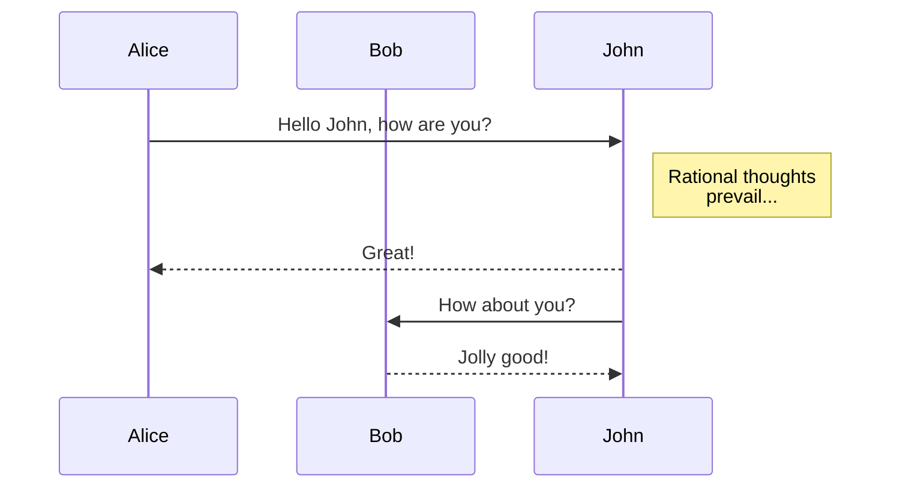

# Markdown Workshop
A repository containing material to explain the Markdown format

Full documentation and examples for the following concepts can be found in the [GitHub Markdown Guide](https://docs.github.com/en/get-started/writing-on-github/getting-started-with-writing-and-formatting-on-github/basic-writing-and-formatting-syntax).

Showcase the following Markdown concepts:
- Headers
- Styling text - bold, italics, strikethrough
- Lists - ordered, unordered
- Todo Lists
- Links
- Quotes - quoting text, code blocks, syntax highlighting
- Tables
- Images
- Alerts

Other fun stuff:
- Emojis
- Collapsible sections
- Create diagrams
- Tables of contents


## Example for quotes

> This is a quote

Typewriter font: `This is a quote`, `filename.txt`, `command`, `echo "Hello, World!"`

```python
def hello_world():
    print("Hello, World!")
```

```bash
echo "Hello, World!"
```

```java
public class HelloWorld {
    public static void main(String[] args) {
        System.out.println("Hello, World!");
    }
}
```

## Example for tables

| Header 1 | Header 2 | Header 3 |
|----------|----------|----------|
| Row 1    | Row 1    | Row 1    |
| Row 2    | Row 2    | Row 2    |
| Row 3    | Row 3    | Row 3    |

## Example for images

## Example for alerts

> [!NOTE]
> Useful information that users should know, even when skimming content.

> [!TIP]
> Helpful advice for doing things better or more easily.

> [!IMPORTANT]
> Key information users need to know to achieve their goal.

> [!WARNING]
> Urgent info that needs immediate user attention to avoid problems.

> [!CAUTION]
> Advises about risks or negative outcomes of certain actions.

## Example for emojis

:smile: :+1: :sparkles: :tada: :rocket: :metal: :octocat:

## Example for collapsible sections

<details>
<summary>Click to expand!</summary>
This is hidden content that can be shown when the user clicks on the title.
</details>

## Example for diagrams




## Example for tables of contents

1. [Example for quotes](#example-for-quotes)
2. [Example for tables](#example-for-tables)
3. [Example for images](#example-for-images)
4. [Example for alerts](#example-for-alerts)
5. [Example for emojis](#example-for-emojis)
6. [Example for collapsible sections](#example-for-collapsible-sections)
7. [Example for diagrams](#example-for-diagrams)
